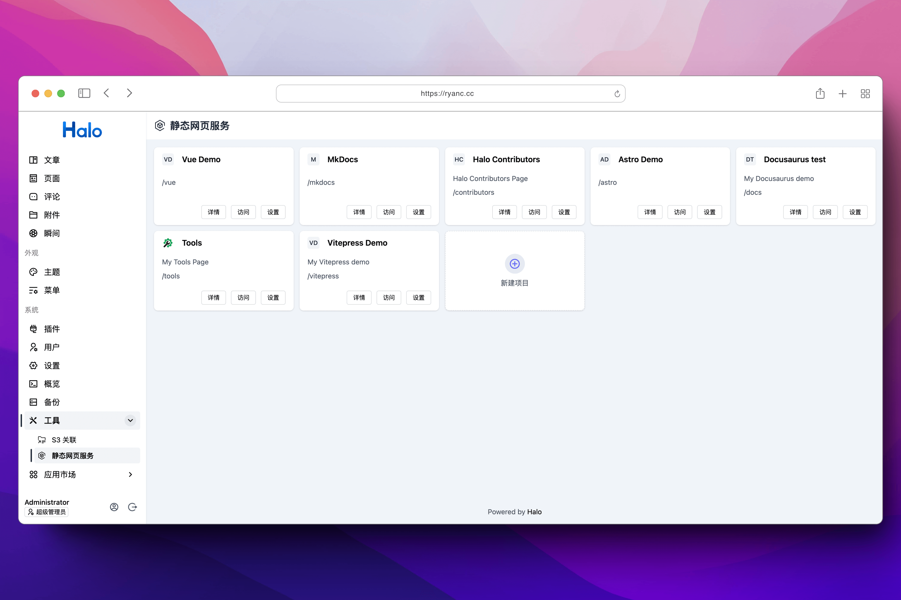
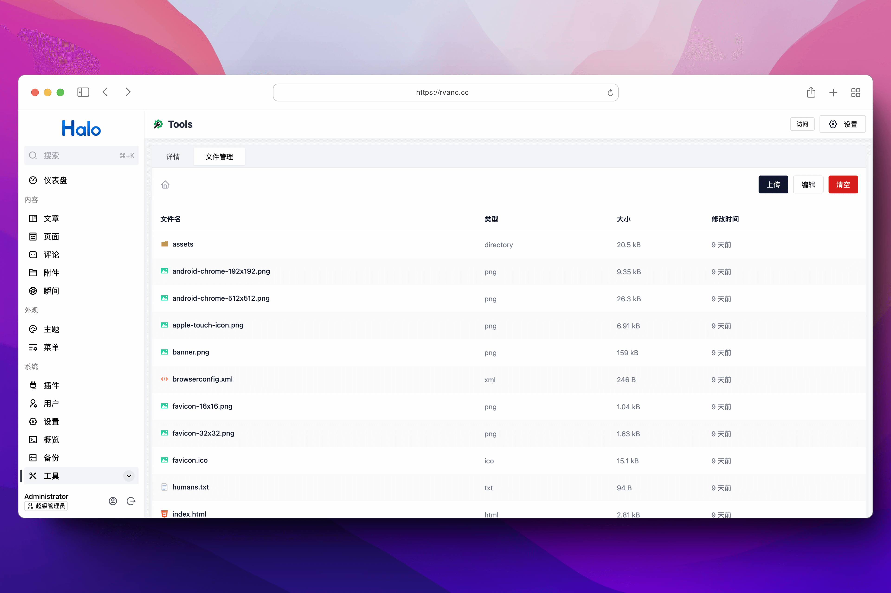
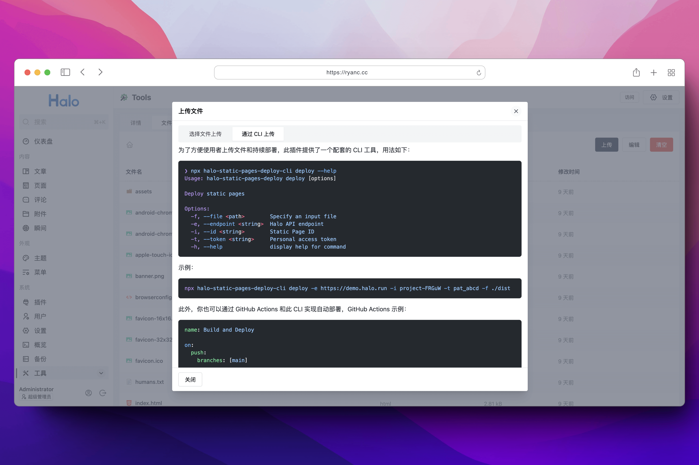
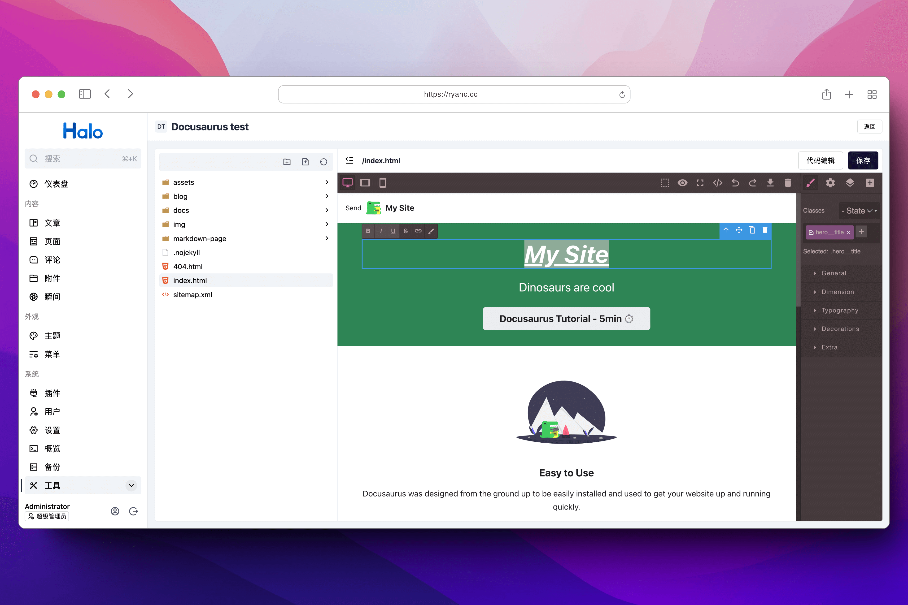

# Halo 静态网页服务插件

这是一个可以在 Halo 托管静态网页的插件，可以将静态网页上传到 Halo，然后提供访问路由。不仅如此，此插件还配套提供了一个 CLI 工具，用于在本地开发时，通过 CLI 快速发布到 Halo 服务，或者与 GitHub Actions 等 CI/CD 工具集成，一定程度上实现自动化部署。

## ✨ 主要特性

- 📦 **静态网页托管** - 在 Halo 中托管任意静态网页
- 🔄 **版本管理** - 自动为每次上传创建版本，支持版本切换和回滚
- 🗑️ **自动清理** - 可配置保留版本数，自动删除旧版本
- 🛠️ **CLI 工具** - 通过命令行快速部署
- 🔁 **CI/CD 集成** - 轻松与 GitHub Actions 等工具集成
- 📝 **可视化编辑** - 在线编辑静态页面内容（实验性功能）

## ⚠️ 关于缓存的注意事项

由于 Halo 默认为静态资源添加了缓存策略，所以在更新静态资源时可能会出现缓存问题，可以通过以下方式解决：

### 设置 Halo 的静态资源缓存策略（推荐）

将 Halo 的 Cache-Control 设置为 `no-cache`，开启之后会禁止在浏览器缓存资源，但仍然会经过服务器进行验证（协商缓存验证）：

如果你使用的是 Docker 或者 Docker Compose，在启动参数配置中添加 `--spring.web.resources.cache.cachecontrol.no-cache=true` 并重建容器即可，示例：

```yaml
services:
  halo:
    image: registry.fit2cloud.com/halo/halo:2.20
    ...
    command:
      - --spring.web.resources.cache.cachecontrol.no-cache=true
```

如果你使用的是 Jar 文件部署，在 `application.yaml` 中添加以下配置：

```yaml
spring:
  ...
  web:
    resources:
      cache:
        cachecontrol:
          no-cache: true
```

### 手动刷新缓存

缓存可能存在于：

- 浏览器：一般强制刷新浏览器页面即可，或者打开浏览器开发者控制台，勾选禁用缓存并刷新一次。
- Nginx：如果开启了 Nginx 反向代理缓存，可能需要同时清除 Nginx 缓存。
- CDN：如果使用了 CDN，可能需要清除 CDN 缓存。

## 预览









> 可视化编辑为实验性功能，请谨慎使用，添加这个功能也是为 Halo 本身探索可视化编辑页面的实现方案。

## 安装

1. https://www.halo.run/store/apps/app-gFkMn
2. https://github.com/ruibaby/plugin-static-pages/releases

## 使用

### 创建项目


- **名称**：项目名称，可以随意填写。
- **目录**：项目的目录，用于存放项目的文件和生成访问地址，目前只能挂载到 Halo 网站的二级目录。

    需要注意，由于目前静态网页只能挂载到 Halo 网站的二级目录，不支持绑定域名，所以请特别注意网页上的资源指向。

    如果你是自己编写的纯 HTML 页面，引入资源建议加上此目录名，比如项目目录填写为 `foo` 时，引入资源的路径应该为 `/foo/bar.js`，或者使用相对于 HTML 文件的路径，比如 `./js/bar.js`。不能写为 `/js/bar.js`，因为 `/` 相对于 Halo 根路径。

    如果你的静态网页使用构建工具构建，可以查阅构建工具的文档，修改基础路径，比如 [Vite](https://cn.vitejs.dev/config/shared-options#base)：

    ```ts
    import { fileURLToPath, URL } from 'node:url'

    import { defineConfig } from 'vite'
    import Vue from '@vitejs/plugin-vue'

    export default defineConfig({
      // 修改为项目目录
      base: '/vue/',
      plugins: [Vue()],
      resolve: {
          alias: {
          '@': fileURLToPath(new URL('./src', import.meta.url))
          }
      }
    })
    ```

- **图标**：项目的图标，可以随意填写。
- **描述**：项目的描述，可以随意填写。
- **最大版本数**：保留的最大版本数量，默认为 10。设置为 0 表示不限制版本数量。当上传新版本超过此限制时，最旧的版本会被自动删除。
- **重写规则**：用于重写页面的请求，可以适用于静态页面存在前端级路由管理的情况，比如 SPA 页面可能只有一个 index.html 文件，那么可以在这里将 **源** 设置为 `/**`，**目标** 设置为 `/index.html`，这样就可以让所有页面请求都指向 index.html 文件。

### 版本管理

此插件支持完整的版本管理功能。每次上传文件时都会自动创建一个新版本，让您可以：

- **保留历史版本**：所有上传都会被保存为独立版本
- **轻松回滚**：可以随时切换到任意历史版本
- **自动清理**：根据"最大版本数"设置自动删除旧版本
- **查看版本历史**：在项目详情的"版本管理"标签页查看所有版本

**使用版本管理：**

1. 上传文件会自动创建新版本
2. 第一个版本会自动激活
3. 在"版本管理"标签页可以：
   - 查看所有版本及其创建时间
   - 激活任意版本（网站内容会立即切换）
   - 删除不需要的版本（活动版本不能删除）

更多详细信息请参考：[版本管理文档](./docs/VERSION_MANAGEMENT_zh-CN.md)

### 上传文件

此插件提供两种上传文件的方式，分别为手动在页面上传和通过 CLI 工具上传。

#### 手动上传

进入文件管理之后，点击右上角的上传即可出现上传文件的对话框，选择文件后即可上传。

#### 通过 CLI

为了方便使用者上传文件和持续部署，此插件提供了一个配套的 CLI 工具，用法如下：

> 此工具使用 Node.js 开发，所以需要安装 Node.js 环境。

```bash
❯ npx halo-static-pages-deploy-cli deploy --help
Usage: halo-static-pages-deploy deploy [options]

Deploy static pages

Options:
  -f, --file <path>        Specify an input file                    # 文件路径
  -e, --endpoint <string>  Halo API endpoint                        # Halo 的访问地址
  -i, --id <string>        Static Page ID                           # 项目 ID，可以在项目详情中看到
  -t, --token <string>     Personal access token                    # Halo 的个人令牌，需要勾选 静态网页项目 -> 项目资源上传 权限
  -h, --help               display help for command
```

示例：

```bash
npx halo-static-pages-deploy-cli deploy -e https://demo.halo.run -i project-FRGuW -t pat_abcd -f ./dist
```

此外，你也可以通过 GitHub Actions 和此 CLI 实现自动部署，GitHub Actions 示例：

```yaml
name: Build and Deploy

on:
  push:
    branches: [main]

jobs:
  deploy:
    runs-on: ubuntu-latest
    steps:
      - name: Checkout
        uses: actions/checkout@v4
      - uses: pnpm/action-setup@v3
        with:
          version: 8
      - uses: actions/setup-node@v4
        with:
          node-version: '20'
          cache: 'pnpm'
      - name: Install dependencies
        run: pnpm install
      - name: Build
        run: pnpm build
      - name: Deploy to Halo # 关键步骤
        run: |
          npx halo-static-pages-deploy-cli deploy -e ${{ secrets.ENDPOINT }} -i ${{ secrets.ID }} -t ${{ secrets.PAT }} -f dist
```

需要注意，你需要在仓库的 Secrets 中添加 `ENDPOINT`、`ID` 和 `PAT` 三个变量，分别对应 Halo 网站地址、项目 ID 和个人令牌（需要勾选 **静态网页项目 -> 项目资源上传** 权限），**请不要将这些敏感信息暴露在公开仓库中**。
